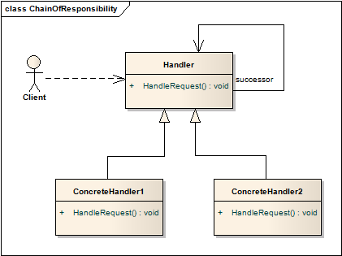
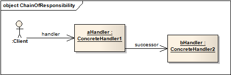

# 职责链模式 Chain of Responsibility
## 意图
通过设立有机会处理请求的中间对象，将请求的发起者和接受者解耦。链接这些接收对象、传递请求，直到该请求被处理。

经典的消息机制、异常处理都是这样一种职责链模式。发起的消息逐层向外传递，直到有处理该消息的对象出现。

## 适用性
* 多个对象会处理请求，不同处理者间的优先级不明确，需要能够自动获知该由谁处理；
* 需要处理一类请求，可能来自不同对象，且没有显示地指明接受者；
* 能够处理请求的一组对象，能够被动态指定。

## 结构

典型的对象结构：

各部分角色的职责：

* Handler
	* 定义处理请求的接口
	* 实现继任者（successor）链接
* ConcreteHandler
	* 处理负责的请求
	* 如果不是其责任范围内的请求，负责将其传递给继任者
* Client
	* 面向的是ConcreteHandler
	* 调用接口 	  

## 模式效果
1. 减少耦合

	对象只需要知道请求会被“妥善”处理，而不用关心是由谁处理；接受者无需知道请求的发起者；链式结构中的对象也无需了解整个链的结构。

	结果是，职责链模式简化了对象间的关联，对象无需维护请求的接受者的引用，只要持有后继者的引用即可。
2. 分派责任更加灵活

	能够在运行时添加或修改对象所负担的责任。
3. 请求不保证会被执行

	由于没有明确的责任对象，无法保证请求会最终被执行。也有可能由于职责链配置问题导致请求不被执行。

## 实现
1. 实现继任者链有两种可行的方式：
	* 定义新的链接（通常在Handler中，但ConcreteHandler需要重新定义）
	* 使用已有的链接

	使用已有的继任者链接，意味着ConcreteHandler	创建时其继任者已经决定？这部分看得还不是太明白，需要之后结合代码再来看。
2. 连接继任者

	 如果没有已定义的链，就必须自己创建。这种情况下，Handler除了定义接口，还要定义继任者。
3. 表达请求

	有多种表达请求的方式，最简单的，是硬编码，讲请求直接写在Handler中，缺点是扩展性不好。

	另一个选择是使用请求编号的方式（例如用一个整型值），根据编码决定如何请求。该做法要求发送者和接受者明确编码的含义。这一做法更为灵活，但需要额外的请求分发工作，而且不是类型安全。

	参数可用objects的方式，单独传输。

