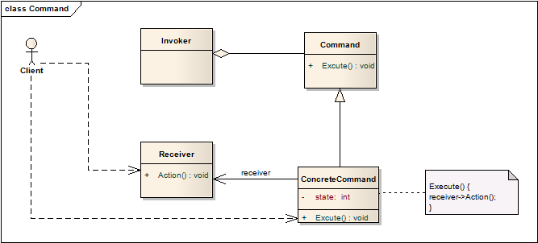

# 命令模式 Command

## 意图
将请求封装成对象，由此可用不同的请求作为参数，将请求队列化，日志输出请求，还支持操作的回退。

也被称为动作模式（Action）、事务模式（Transaction）。

## 适用性
当你有以下需求时使用命令模式

* 将动作执行参数化。命令模式就是回调函数的面向对象的替代。
* 描述请求、队列缓存请求、不在请求创建时执行请求。
* 支持回退操作，这要求命令对象除了执行操作外，还提供回退操作的接口。
* 支持输出请求变化日志，当系统奔溃后能够从断点恢复执行。数据库一般都有类似的操作日志。
* 在底层操作的基础上使用上层操作构建系统。典型的应用就是数据库操作中的事务（Transaction）。每个事务都包括多个基本的操作，当所有操作都成功后事务才提交，否则回退所有的操作。

## 结构

其中，Client的责任是创建ConcreteCommand，并为其指定Receiver。

## 模式效果

1. 命令模式将对象调用执行和如何执行解耦。
2. 命令是一级对象，这意味着能够像其他对象一样操作、扩展。
3. 可以讲多个命令集成为一个复合命令。
4. 很容易添加新的命令，因为这不会影响已有的类。

## 实现
实现命令模式时需要考虑以下一些问题：

1. 命令该有多智能？

	一个极端是仅仅提供了receiver，用来调用请求，另一个极端是完全不管receiver，在命令中将请求实现。

2. 支持回退和重新执行

	除了提供相应的接口，ConcreteCommand类还需要存储额外的状态，可能包括：

	* 接收请求的对象
	* 操作执行的参数
	* 接收对象的原始状态，确保能够让接受者回退到上一状态

	一级回退，只要存储上个命令；多级回退就需要存储历史命令列表。
	
	一个可回退的命令必须支持拷贝，因为需要拷贝到历史命令列表中，而不能仅仅是存储命令的引用，因为命令可能会被修改。

3. 在回退操作时避免出现错误累积情况
4. 考虑使用C++的模板实现