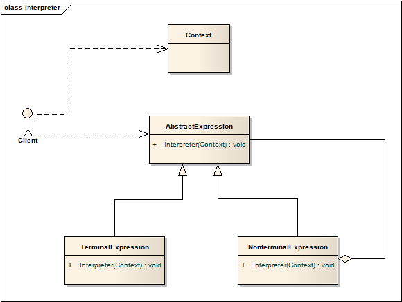

# 解释器模式 Interpreter

## 意图
定义语言的语法，并能够使用该语法解释该语言中的句子。

## 适用性
当有一种语言需要翻译，而且能将该语言中的语句用抽象的语法树表示时，可以使用解释器模式。解释器模式在以下情况下运行得最好：

* 语法简单

	复杂的语法就需要复杂的、庞大的、难以管理的类结构。对于这种情况使用像解析生成器（parser generator）这样的工具是一种替代方案，它能够在不创建抽象语法树的前提实现解释语言，能够节省空间和时间。

* 效率不是主要的考量

	最高效的解释器通常不是通过解释器实现，而是将它们转化成另一种形式。

## 结构

解释器的核心，就是建立这样一个语法树，用户直接面向抽象基类，调用解释方法翻译内容。

## 模式效果

1. 方便修改和扩展语法。

	修改现有类实现修改语法，通过新增类实现扩展语法。

2. 实现语法也容易

	语法树中的大部分结点代码都比较类似，实现了一个之后其他差不多也都有了。

3. 复杂的语法难以维护

	在解释器模式中，至少有一个类需要了解语言中所有的语法，所以如果有许多规则，就很难管理和维护。当语法复杂时，其他的技术，例如解析器（parser）、编译器（compiler）就更为合适。

4. 添加新的方式来解释表达式

	通过解释器模式，能够方便地为表达式提供新的评估方式。例如，对一个语句以更为漂亮的方式输出。如果你持续创建新的解释方式，建议使用访问者模式（Visitor）。

## 实现
解释器模式和组合模式实现时有很多相似之处，下面是一些解释器模式特有的话题：

1. 创建抽象语法树。

	对于抽象语法树的创建方式，解释器模式没有硬性规定。具体问题具体分析。
2. 定义解释器的操作

	不需要在表达式类（Expression class）中定义解释器的操作，通常将新创建的解释器，放在访问者对象中。
3. 使用蝇量模式共享最小符号

	语法中会有许多基本的最小符号（例如英语中的字母，算数运算中的加减乘除符号），能通过蝇量模式共享资源从而获益。

	最小结点通常不会存储他们在抽象语法树中的位置，由父节点负责提供上下文信息。这就涉及到蝇量模式中的一个概念：内部状态和外部状态。