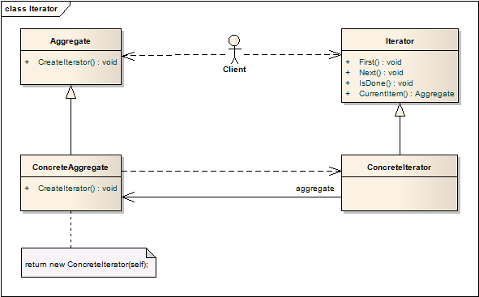

# 迭代器模式
## 意图
提供一种顺序访问对象集合的方法，而不用关心其底层实现。

也称为游标（Cursor）。

## 适用性

* 不暴露内部表现的情况下，访问一个集合对象；
* 支持对集合对象的多重遍历；
* 为遍历不同的集合结构，提供统一的接口；

## 结构

创建迭代器，需要调用集合中的接口。

## 模式效果

1. 支持集合遍历方式的变化

	复杂的集合可能会以多种方式遍历，迭代器模式使得变更迭代算法变得简单，只需要用一个新的迭代器实例替换当前的即可。
2. 迭代器简化了集合的接口

	集合本身有遍历的需求，通过迭代器来实现了这些功能，集合的接口就得以简化。
3. 集合可以有多种遍历方法

	集合的遍历状态，由迭代器维护，因此集合同时可以有多个遍历。

## 实现
迭代器有许多的实现变化和选择，其中的取舍往往是依赖于实现的语言。下面是一些重要的方面：

1. 谁控制迭代？

	是由迭代器还是客户控制迭代？当用户控制迭代，称为外部迭代器，如果由迭代器自身控制，称为内部迭代器。

	外部迭代器比内部迭代器更为灵活，能够简单地比较对象相等。内部迭代器对于像C++这样没有匿名函数、闭包的语言，不是很有意义，但使用起来很方便，因为迭代逻辑集成在迭代器中。
2. 谁定义遍历算法？

	并非只有迭代器可以定义遍历算法，集合本身也可以定义遍历算法，迭代器只是用来存储迭代的状态。将这种迭代器称为**游标**，因为它仅仅用来指向集合中的当前位置。

	如果由迭代器定义遍历算法，就很方便对同一个集合使用不同的遍历算法，也可以将同样的遍历算法用到不同的集合上。反之，由于遍历算法会访问集合的私有成员，会破坏集合的封装。
3. 迭代器的鲁棒性如何？

	迭代时修改集合非常危险，可能会访问同一对象两次，也可能错过某个对象。简单的解决方案是遍历集合的拷贝，但这样做代价太高。

	一个鲁棒性好的迭代器需要确保插入和删除时不会干扰迭代，而且不用拷贝集合
4. 额外的迭代器操作

	除了上述的迭代器基本操作，还有一些额外的操作，也很有用。例如，有序集合有Previous操作访问前一个元素；对于已排序的或已索引的集合SkipTo操作也很有用。
5. C++中使用多态迭代器

	多态迭代器的对象是通过工厂方法动态创建的，只有在支持多态时才使用，否则就用具体迭代器，在栈上分配。

	多态迭代器还有一个缺点：用户需要负责删除对象，很多时候用户都会忘记释放堆上的对象，尤其是当操作有多个出口点时。

	代理模式提供了弥补方案。可以使用在栈上分配的代理作为实际迭代器的替身，在代理的析构中释放迭代器。当代理离开作用域时，迭代器也被一并释放。即使在发生异常时，代理也能清理干净堆上的资源。这是C++为人熟知的技术“资源分配即初始化（resource allocation is initialization）”。
6. 迭代器的访问特权

	迭代器可以被看成是集合的扩展，两者是紧耦合的，在C++中，可以将迭代器设置为集合的友元，这样迭代器就能直接访问集合属性，是遍历更为高效。

	然而，这种访问特权会使定义新的遍历变得困难，因为要求集合定义新的友元。为了避免这一情况，迭代器可以包含保护方法（protected operation）访问集合的非公开但核心的成员，迭代器的子类（且仅是子类）可以通过这些方法访问集合。
7. 组合的迭代器

	外部迭代器想要实现对迭代形式的组合集合进行遍历，会比较困难，因为集合结构中的位置可能是许多层级的嵌套，因此外部迭代器需要记录下组合位置的完整路径。使用内部迭代器就比较方便，因为组合中的对象能够方便地掌握自己的当前位置。

	如果组合中的结点支持移动，那游标型的迭代器是更好的选择，只需要保存当前结点的追踪。

	组合通常需要多种迭代方式，前序、后序等，可通过不同迭代器类实现各种遍历方式。
8. 空迭代器

	空迭代器是一个退化的迭代器，用来判断边界条件时很有用。通过定义，空迭代器总是遍历的完成，调用IsDone的结果总是true。

