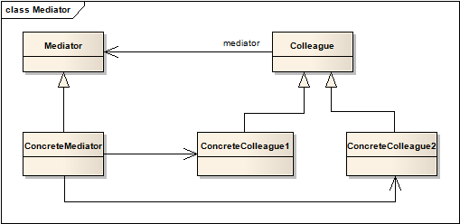
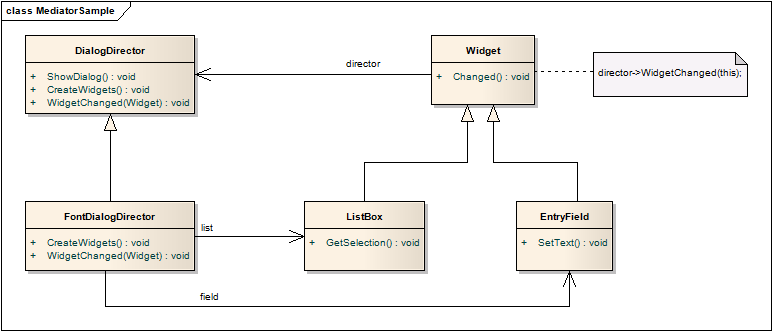

# 中介者模式 Mediator

## 意图
定义一个对象，封装一系列对象的交互。中介者模式推崇松耦合，防止对象显示地互相引用，通过中介者能独立地切换交互方式。

## 适用性

在以下情况时考虑使用中介者模式：

* 一系列对象间的交互定义得非常清晰，但又非常复杂
* 复用对象困难因为它引用了许多其他对象
* 在多个类之间的分发行为，不需要引入很多子类，就能够实现。

## 结构

这个结构比较抽象，添加一个具体的实例：

其中DialogDirector相当于Mediator，FontDialogDirector相当于ConcreteMediator。当任何一个Widget有变化时，会通过WidgetChanged方法通知Mediator，Mediator再对相关的Widget进行更新。这样做将一系列的Widget从交互中解脱，统一和Mediator进行。

## 模式效果

中介者模式有以下一些好处和不足：

1. 限制了继承的泛滥

	中介者实现了原本要在多个对象互相交互的行为，变更行为只需要实现子类继承中介者，同僚类（Colleague）可以复用。
2. 解耦了各同僚

	中介者模式使同僚之间松耦合，很方便变化和复用各同僚和中介者。
3. 简化了对象协议

	中介者模式将多对多的协议简化为了一对多，这更有利于理解、维护和扩展。
4. 抽象了对象的协作方式

	将中间件独立开来，开发时能够专注在业务对象本身。
5. 集中控制

	将同僚之间的复杂度转化为中介者内部的复杂度。因为中介者封装了协议，变得比其他对象更为复杂，这使得中介者本身更加难以维护。

## 实现

1. 忽略抽象的中介者类

	当系统中只存在一个中介者时，可忽略抽象的中介者类，只有在多个中介者的情况下抽象类才有意义。
2. 同僚与中介者通信

	当有中介者关心的事件发生时，同僚需要发起通信，可以使用观察者模式来实现这一功能。将中介者视为观察者，将同僚类设为主题。

	另一种方式是在中介者中定义一个通知接口，需要发起通信时调用该接口。

## 模式思考
与外观模式相比，有一个显著的特点是中介者封装的是一个系列的对象（a set of objects），这些对象彼此之间有着潜在的联系，这一概念和工厂模式的核心“簇”（Family）有点相似。

另一方面，Facade封装了子系统对外的接口，而Mediator对于系列中对象之间的访问也进行了封装，使得这些对象也只和Mediator交互。