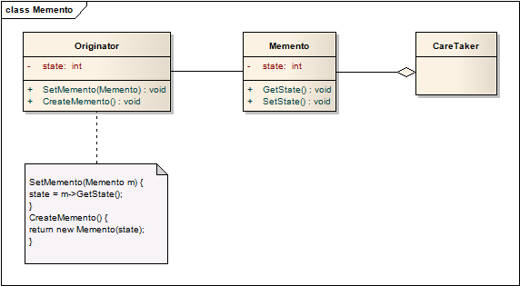

# 备忘录模式 Memento

## 意图
不破化原有的封装，获取对象的内部状态并记录，使得对象在将来能够回退到这一记录的状态。

也被称为Token。

## 适用性

* 需要存储对象状态（至少是部分状态）的快照，用来在未来某些情况下回退对象；
* 通过直接接口访问的方式获取状态会暴露对象的实现细节，破坏对象的封装；

## 结构

Memento对于Caretaker只开放**窄接口**——Caretaker只存储和传递Memento，但不能访问其中的state，对于Originator开放**宽接口**——能够访问state。

## 模式效果

1. 保护已有封装

	备忘录模式避免了暴露仅有发起人管理、但又必须存储在外部的信息。
2. 简化了发起人

	其他设计方案中，发起人必须自己保存快照信息。使用备忘录模式后，快照信息存储在发起人的外部，简化了本身对象。
3. 使用备忘录的代价可能会较高

	如果发起者每次快照需要记录大量信息、或是用户使用快照的过于频繁，备忘录模式可能会导致相当可观的维护开销。尽量确保发起者需要回退的状态轻量级情况。
4. 定义窄接口和宽接口

	宽窄接口的说明在结构章节中提到，这一需求在部分语言中较难实现。
5. 维护备忘录时的隐藏开销

	Caretaker负责维护备忘录（包括删除），但它并不了解备忘录中包含多少状态信息，因此一个轻量级的Caretaker可能会因为维护大量备忘录而占用大量存储。

## 实现
有以下两个话题需要考虑

1. 语言的支持

	备忘录模式需要宽窄两种接口，理想情况下实现语言要支持两层的静态保护。C++中，你可以将*宽接口设为私有，然后将发起人设为友元，将窄接口设为公开*。
2. 存储变化增量

	当备忘录按照一个可预测的顺序创建和传回时，可以只存储发起人内部状态的增量信息