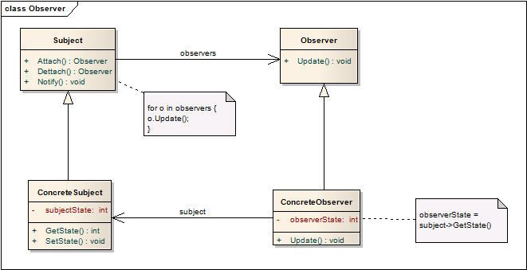
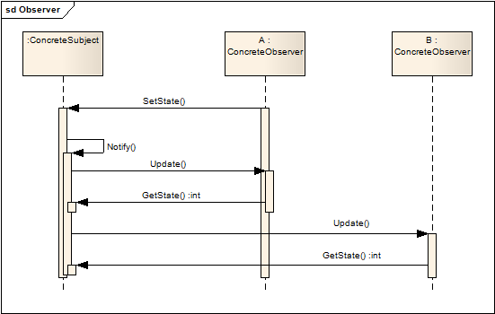
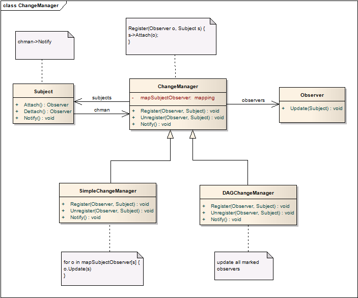

# 观察者模式 Observer

## 意图
在对象间建立了一对多的依赖，当一个对象状态变化，会通知所有依赖对象并自动更新。

观察者模式也被成为依赖（Dependents）或发布订阅模式。

## 经典场景
订报纸

## 适用范围

1. 系统抽象包括两部分，其中之一依赖另外一部分；
2. 一个对象变化会使得其他对象变化，而且你事先不知道会有多少对象会需要变化；
3. 一个对象能够在事先不用知道其他依赖对象的情况下通知他们，这些对象是松耦合的。

## 结构

## 运作流程

以下流程图描述了1个Subject和2个Observer之间的协作

## 模式效果

1. Subject和Observer之间的松耦合；
2. 能够支持广播通信；
3. 会出现“预期之外的更新”情况；

## 实现细节
1. 建立Subjects和Observers的映射

	关联Subject和Observers最直接的方法是在Subject中存储Observers的索引。但是，当有大量Subject和少量Observers时这种作法的存储消耗过大。一个解决的方法是建立统一Subject-Observer的映射，这样没有Observer的Subjectjiiu不会占用额外空间。
2. 观察多个Subject

	一个Observer可能观察多个Subject，单纯适用Update无法知道是那个Subject发生了变化，需要在Update带上Subject信息。
3. 由谁负责调用Notify？

	* 在State的Set方法中调用。好处是用户可以不用关心这一过程；缺点是每次Set都会Notify，效率低。
	* 由用户负责选择调用时机。好处是效率更高；缺点是用户可能忘记调用。

4. 已删除的Subject的游弋引用

	Subject删除时会在Observer里残留游弋引用，解决方法是当Subject删除时进行Notify，让Observer能够删除引用
5. 确保State的一致性
6. 避免适用 push 和 pull 模型

	* push模型：把所有的变更信息全部发送给Observer，不管是不是需要；这一模型假设了Subject知道Observer的需求，复用性变差；
	* pull模型：只发送一个变更通知，具体的变更内容需要Observer自行获取；这一模型强调了Subject对于Observer一无所知，效率偏低
	* 那到底该如何取舍？

7. 按需发布

	在attach时添加interest信息，notify时根据interest进行，有的放矢。
8. 当结构较为复杂时，可添加中间件`ChangeManager`

	

9. 合并Subject和Observer

	一个对象很可能既是Subject也是Observer，在缺少多重继承的语言中就需要将这两个类合并，作为一个Observer基类进行使用。

