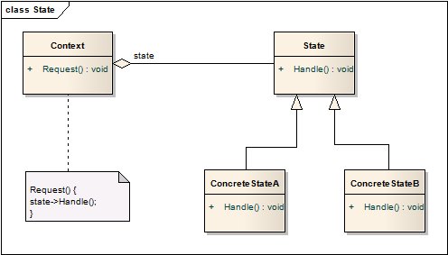

# 状态模式 State

## 意图
允许一个对象在其内部状态改变时改变它的行为。对象看起来似乎修改了它的类。

一个对象的行为，会因为其所处的状态而发生变化，需要有大量的`if...else...`分支，此时就可以考虑使用状态模式。

## 适用性
状态模式适合以下场景：

* 对象的行为受其状态约束，在运行时依据状态会发生变化；
* 对象的行为有一大块依赖状态的条件分支语句。状态通常是一个常量枚举。状态模式将每个条件分支放在一个独立类中，使得处理每个分支转变为调用类方法。

## 结构

* Context将请求委托给具体的State执行；
* Context可能会将自身作为参数传给State，使其能够访问Context内容；
* Client只和Context交互，能够通过接口设定State，并不直接访问State；
* Context或ConcreteState决定状态迁移的场景和方式；

## 模式效果
1. 将状态指向的行为本地化，并根据不同状态区分行为。将特定状态的相关行为放进了一个对象中；因为状态和行为绑定，方便添加新的状态；
2. 将状态迁移的过程隐藏；
3. 状态对象可共享；
	* 状态对象没有实例变量，仅仅是根据类型进行编码，那就是可共享的状态对象；
	* 天然的蝇量模式（没有内部状态，只有行为）

## 实现
1. 由谁定义状态迁移？

	状态模式没有限定状态迁移的标准。如果这是固定的，则能够由代码的上下文决定状态迁移。更为灵活的方式是由子类决定迁移方式，这就需要一个额外的接口用于设定状态。

	不固定的方式对于添加新的状态更为灵活，但是使得子状态之间不再那么透明，每个子状态至少要知道一个其他子状态的，从而实现状态跃迁。

2. 一种基于表的（状态模式）替代方案

	创建一张表，将输入映射到状态迁移。对于每种状态，表将可能的输入映射到后续的状态。

	这一方案的主要优点是其规则性：能够通过变换数据，而非代码来实现规则的变化。

	然而，也有以下一些缺点：
	
	* 查表比（虚）函数调用更为低效；
	* 将迁移逻辑归一化、表格化使其更加难以理解；
	* 想要将额外的行为添加进状态迁移通常会比较困难；

	表驱动的状态机和状态模式的差异总结：状态模式强调与状态绑定的行为，表驱动的状态机着眼于定义状态迁移。

3. 创建和删除状态对象
	
	一个实现时通常需要权衡的是状态对象的生命周期：是使用时创建，用完就删除，还是提前创建好，用完也不删呢？

	前者通常在状态只有在运行时才能确定的场景下，而且环境较少变更状态，当状态中包含很多信息时，避免了创建这类状态的花费。

	后者对于状态迁移频繁的场景适应性更好，避免了频繁创建状态。但这种作法也有不方便之处，代码空间中需要维护针对所有状态的引用。

4. 使用动态继承

	部分语言支持。可将方法委托给不同类型的对象，实现某种程度的动态继承。