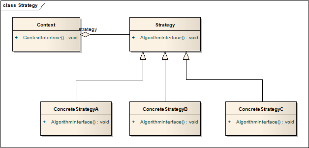

# 策略模式 Strategy

## 意图
定义了一系列的算法，对其进行封装，使他们互为可交换。策略模式使得各算法在使用时能够切换。

为了解决某个问题、实现某个功能，存在多种方法（或算法），将这些方法全部在调用对象中实现显然不合理。将这些方法抽离出来单独实现，称为“策略”，使用时根据需要选择合适的策略装载，大概就是策略模式的含义。

## 适用性
* 策略模式提供了将一个类与多种相似相关行为之一关联的方法；
* 你需要同一算法的不同变种；
* 算法数据中包含了用户不必知道的细节，使用策略模式以免暴露复杂的、算法相关的数据结构；
* 一个类定义了许多行为，会在一个多条件判断中选择执行哪种行为。使用策略模式替代这种条件判断；

## 结构

* ContextInterface调用Algorithm的时候，需要将所有的必要参数传入，或者将自身引用传入；
* 由用户选择具体策略，传递给Context，再调用ContextInterface执行策略；

## 模式效果

1. 相关算法家族

	通过这样的抽象架构能够提取出算法的公有功能。

2. 继承之外的另一种选择

	策略模式符合“使用组合，而不是继承”的原则，更为灵活。

3. 通过使用策略模式，去除了大量条件分支语句
4. 具体实现的选择

	为相似的行为提供了不同的实现，由用户根据时间、空间的取舍决定具体的实现。

5. 用户必须理解不同的策略

	用户必须了解自己的选择的后果，了解所有备选算法的实际功效。

6. Strategy和Context之间的通信

	由于所有的策略都有相同的接口、相同的参数，就存在复杂算法需要更多参数，而简单算法可能完全不需要参数。为了复杂算法准备的参数，在选用简单算法时就显得累赘且浪费时间。

	如果想要解决这一问题，就要求Context理解Strategy接口的参数含义，而这又造成两者不再是松耦合状态。

7. 对象数量的增加

	策略模式增加了应用中对象的数量。一个解决办法是将策略设计为无状态对象（没有类成员变量，只有成员方法），然后让Context共享这些策略。

	蝇量方法对于这类实现更有心得，会在相关章节中详述。

## 实现

1. 定义Strategy和Context接口

	Strategy和Context的接口必须提供ConcreteStrategy必要的参数，有两种方式：
	
	* 将参数以参数列表方式写在接口中，做到了Strategy和Context的解耦，但可能会给Strategy传递不必要的参数；
	* 将Context本身的引用传递给Strategy，Strategy记录该引用，需要什么参数就获取什么参数，这样两者的耦合程度就更高。

	根据实际需要决定使用哪种方法。

2. 将Strategy作为模板成员变量

	C++ 模板允许将Strategy作为模板变量使用：

		// Context
		template <class AStrategy>
		class Context {
		public:
			void Operation() { theStrategy.DoAlgorithm; }
		
		private:
			AStrategy theStrategy;
		}
		
		// Strategy
		class MyStrategy {
		public:
			void DoAlgorithm();
		}
		
		// sample
		Context<MyStrategy> aContext;

3. 将策略设为可选

	在使用前先判断策略是否有效，如果无效则使用Context的默认方法，如果有效，则调用策略方法。