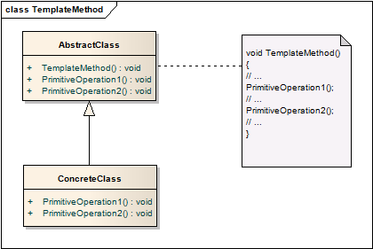

# 模板方法模式 Template Method

## 意图
定义算法的主体框架，而将其中的某些步骤移交给子类决定。模板方法在不改变算法框架的前提下让子类能够重新定义部分步骤。

模板方法针对的是一个具体的方法，将其步骤模板化，而实现的过程交给了子类。

## 案例
以项目开发的一般周期来说，不同项目实施方案肯定不同，但都可以归纳到同一个模板：需求收集、立项、设计、开发、调试、发布。这样一个开发的流程就是一个模板方法。

## 适用性

1. 将算法中不变的部分一并实现，将可变部分留给子类实现；
2. 各个子类中有相同的行为或代码，将这些整合在模板方法中；
3. 限制子类的扩展。符合“开放封闭原则”，开放的是部分步骤，封闭的是整体框架，每个开放的部分对于子类就是一个“钩子”，子类只能在这些部分进行扩展；

## 结构

## 模式效果

模板模式引出了一种控制结构，一般称为“**好莱坞原则**”——“不要来找我们，我们会找你”。这里AbstractClass就是好莱坞大导演，而ConcreteClass就是试镜的小演员，ConcreteClass只负责自己有限的职责——实现Operation1和Operation2，调用工作有AbstractClass负责。

AbstractClass必须明确哪些方法是可以被重写，哪些是必须被重写，而哪些又是不能被重写。

## 实现

1. 合理使用C++的访问控制

	* primitive方法是必须被重写的，必须为纯虚函数，确保子类会重写；
	* 为了确保primitive方法不被外部访问，可以设置为protected权限；
	* 模板方法是不希望子类重写的，不能设为虚函数；

2. 尽可能减少Primitive方法的数量

	能够简化子类的实现。

3. 命名规则

	通过使用命名规则来提示子类的继承实现。