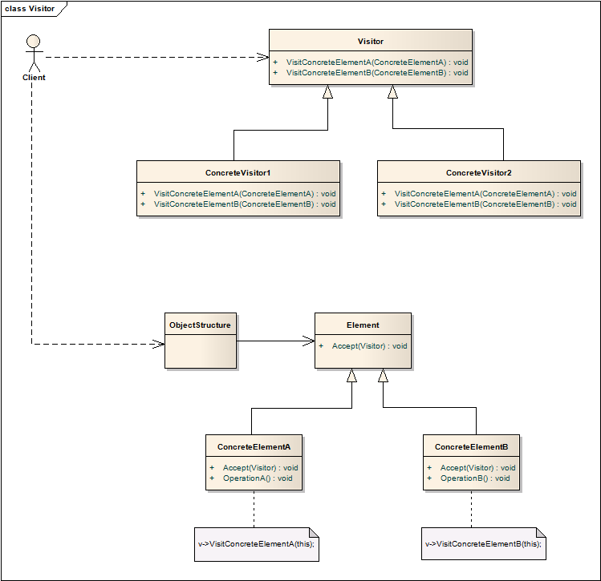
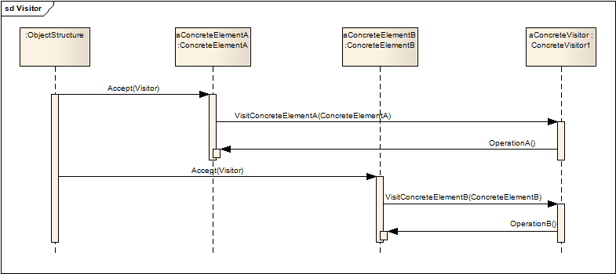

# 访问者模式 Visitor

## 意图
封装一些施加于某种数据结构元素之上的操作。访问者使你能够在不修改操作元素的类的情况下定义新的操作。

## 适用性

* 一个数据结构中包含许多类，有着不同的接口，希望根据不同的类执行不同的操作。
* 对象会执行许多不同且没有关联的操作，你不希望对象的类被这么多操作锁“污染”。访问者让你将相关的操作定义在一个类中。
* 数据结构中的类很少发生变化，但会对整体机构定义新的操作，修改数据结构中类的接口会影响所有的访问者，代价高昂，如果数据结构中类变化频繁，最好将这些类定义在访问者中

## 结构

从结构定义中能够看出，抽象访问者中定义了所有ConcreteElement的访问方法，所以整个结构中的Element要尽可能固定。

## 协作流程

* 使用访问者模式必须创建具体访问者对象，遍历整个数据结构，使用访问者访问每个元素。
* 当元素被访问到时，调用访问者的对应方法。

## 模式效果

1. 访问者模式很容易添加新操作

	通过添加一个新的访问者，能够对结构中所有对象定义新的操作。
2. 访问者将相关的操作聚集，分隔不相关的

	相关的操作被定义在同一个访问者中，不相关的操作由不同访问者持有。
3. 添加新的Element实例困难

	正如之前章节提到的，访问者要有对所有Element都有相应方法，所以添加新的Element会比较困难。
4. 访问整个类层级结构

	可以使用迭代器遍历对象，但迭代器不能遍历不同类型的元素。这就要求这些元素都有相同的基类。

	但访问者并没有这样的限制，调用访问者的对象完全可以是有着不同的基类。
5. 累积状态

	当访问者逐个访问元素时，可以累积状态，否则就要将这一状态在遍历过程传递，或者记录为全局对象。
6. 打破了封装

	访问者直接访问了ConcreteElement，打破了元素的封装。

## 实现

实现时要考虑以下两个问题：

1. 双重分发

	访问者模式能够给类添加方法而不修改类，这是使用了双重分发技术实现的。

	支持单分发的语言，决定调用什么方法的，是请求名和接受者的类型（想象多态）。

	双重分发意味着方法的执行由请求类型和两个接受者，例如Accept方法就有Visitor和Element共通决定。

	
2. 由谁负责遍历对象结构？

	可以有三个地方来实现遍历，分别是对象结构内部、访问者内部、或是另外实现迭代器。

	对象结构内部实现遍历是最常见的做法，因为迭代内部的元素实现起来最便捷。

	使用内部迭代器还是外部迭代器都可以，很大程度上取决于语言的特性。

	在访问者中实现遍历也是可行的，一般用来实现比较复杂的遍历逻辑，但这样的话每个具体访问者都要实现遍历的代码，会比较麻烦。