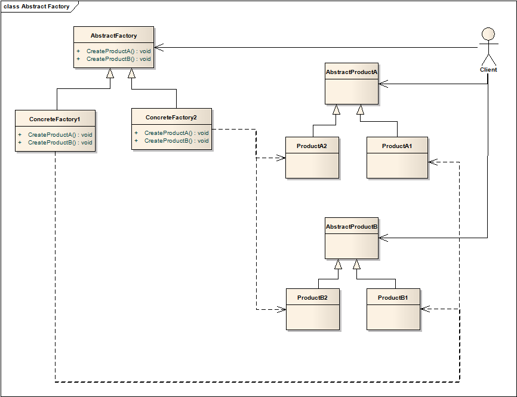

# 抽象工厂模式 Abstract Factory

## 意图
提供接口，用于创建一族对象，而无需指定具体的类。

抽象工厂也被称为工具箱（Kit）。

## 概念说明：产品家族
要理解抽象工厂，首先要理解产品等级（或者称为产品线）及产品家族（Famiy）的概念。一系列类似的产品属于同一产品线（或产品等级），而一套产品组成了一个产品家族。

以MonsterHunter中的装备举例，全套装备的产品家族就应该包括以下产品线：头盔、胸甲、臂甲、裙甲、腿甲，每个产品线会有多个产品，比如头盔有野猪王头盔、轰龙头盔，胸甲也有野猪王胸甲、轰龙胸甲。每个套装就是一个产品家族。

## 适用性
1. 系统不必关心产品是如何创建、组合和表现的；
2. 系统每次使用多个产品家族中的一个；
3. 产品家族中的产品总是打包使用，这个限制需要强调；
4. 你想要提供一类产品，但只提供接口而不是具体实现；

## 结构

## 运作流程
* 通常，具体工厂在运行时创建，每个具体工厂中有产品创建的具体实现，为了创建不同的产品对象，需要使用不同的具体工厂；
* 抽象工厂将产品的创建交给其具体工厂处理；

## 模式效果
* 使用抽象类隔离具体类；
* 能够比较容易地按家族替换产品；也能够方便地添加一族产品；
* 确保产品的一致性，一个家族的产品一并使用；
* 对于添加产品线较为困难；

## 实现细节
1. 将工厂创建为单例（Singleton），因为通常每种工厂只需要一个实例；
2. 抽象工厂只提供接口声明，具体的创建由具体工厂实现。通常，为每个产品线定义一个工厂方法。（工厂方法的详细描述见相关章节）；
3. 定义扩展工厂。添加一个产品线对于抽象工厂会比较麻烦，需要修改所有依赖的类，一个可行的方法是工厂只提供一个`Make`方法，该方法接收一个参数，从而决定创建的具体对象。

## 其他
抽象工厂的核心就是产品家族、产品线的创建，根据“开放-封闭”原则，抽象工厂是对产品家族的扩展开放、对产品线的扩展封闭的一种设计模式。

正如抽象工厂的适用场景的描述，当我们有多个产品家族、存在每次使用其中一个完整的家族的约束，这时候抽象工厂模式可能就是我们想要的。
