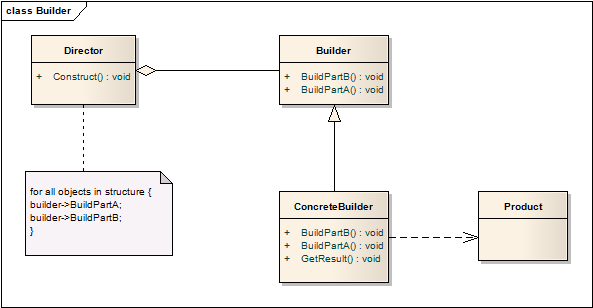

# 生成器模式 Builder

## 意图
它可以将复杂对象的构造过程与其表现分离、抽象出来，使这个抽象过程可以构造出不同表现（属性）的对象。

## 模式比喻
我要一座房子住，可是我不知道怎么盖（简单的砌墙，层次较低），也不知道怎么样设计（建几个房间，几个门好看，层次较高），于是我需要找一帮**民工，他们会砌墙**，还得找个**设计师，他知道怎么设计**，我还要**确保民工听设计师的领导**，而设计师本身也不干活，光是下命令，这里砌一堵墙，这里砌一扇门，这样民工开始建设，最后，我可以向民工要房子了。在这个过程中，**设计师是什么也没有，除了他在脑子里的设计和命令，所以要房子也是跟民工要**

## 适用性
在以下场合使用生成器模式：

* 创建复杂对象的算法要与对象组织的部分分离；
* 对象的创建过程允许不同的表现方式

## 结构

角色分析：

* Builder
	* 定义用于创建产品各部分的抽象接口 
* ConcreteBuilder
	* 通过实现Builder的接口创建和组装产品的各部分
	* 定义和追踪其创建的表现 
	* 提供取回完整产品的接口
* Director
	* 通过调用Builder接口创建对象 
* Product
	* 代表了创建出的复杂对象。ConcreteBuilder构造了Product的内部表现，定义了其组装过程
	* 包含了组成Product的部件类，包括将这些部件组装成最终结果的接口

模式时序图：

## 模式效果
1. 能够改变产品的内部表现。

	Product通过抽象接口进行构建，通过定义一种新的Builder就能改变产品的内部表现。

2. 将产品的构造和表现分离

	生成器模式封装了复杂对象的构建和表现。客户不用知道定义产品内部结构的类。

	ConcreteBuilder包含了所有的创建和组装某类产品的代码。这些代码只用写一次，不同的Director可以复用这些代码，来构造产品。

3. 对于构建过程提供了更好的控制

	与其他创建类型的模式不同，生成器模式在Director的控制下一步步构造产品，仅在产品完成后才从Builder中取回。

## 实现
通常，Builder是个虚类，只负责定义接口，ConcreteBuilder实现这些接口创建产品。

以下是一些实现时需要考虑的问题：

1. 组装和构建接口：

	Builder的抽象接口要能够支持所有的ConcreteBuilder的构建。

2. 为什么没有抽象的Product？

	ConcreteBuilder创建的Product可能千差万别，难以设定一个通用的抽象基类。

	通常用户给Director配置合适的ConcreteBuilder，所以用户能够知道具体的Builder子类正被使用，能够合适地处置产品。

3. Builder中接口默认为空

	在C++中，构建方法通常不能为虚函数，而是被定义为什么都不做的空函数，有用户来重写他们感兴趣的方法。