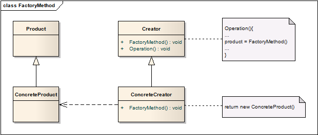
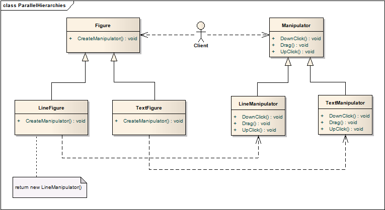

# 工厂方法模式 Factory method

## 意图
定义一个创建对象的接口，由子类决定具体实例化的类型。工厂方法让类的实例化推迟到子类中进行。

## 适用性
* 一个类无法参与该类所必须创建对象的创建过程（只能下放给子类参与）；
* 一个类希望由子类决定创建对象的类型；
* 一个类将创建对象的责任委托给了几个子类，而不必去关心这些委托具体是如何实现的。

## 题外话
提到工厂方法，很容易联想到抽象工厂，但从两种方法的适用范围来看，着重点是有差异的。

抽象工厂着眼于产品家族、产品线，强调每个具体工厂有一个完整的产品家族；工厂方法更注重对象的创建责任委托，即由子类去考虑究竟该创建什么对象，怎么创建对象。

## 结构

Creator依赖其子类定义工厂方法，返回合适的具体对象。

## 模式效果

工厂方法去除了代码对于特定应用类的依赖，代码只和Product的接口打交道，因此能和用户定义的所有具体Product交互。

一个潜在的缺点是用户必须实现Creator的子类、仅仅是为了实现工厂方法。

还有两个额外的效果：

1. 为子类提供钩子

	将对象创建的过程封装在工厂方法总比直接创建对象更为灵活。当对象版本有扩展时，工厂方法为子类提供了现成的钩子。

2. 连接平行的类层次

	这个概念比较抽象，需要一个实例辅助理解。

	假设有个图形对象，用户可对其进行拉伸、移动等操作。考虑到图形类型多样，实现这类交互并不容易，有些属性是与图形描绘相关，表示的是图形的性质，有些属性与操作相关，不同的图形可能会有不同的属性，相当的操作会有不同的实现方法。

	考虑到以上一些限制，一个合理的设计是将图形以及其操作分离，但每种特定的图形又有其对应的特定操作。其结构图如下：

	

## 实现

当实现工厂方法模式时考虑以下问题：

1. 两种主要的形式

	* Creator是抽象类，无法实例化对象，使用时必须定义子类并定义工厂方法；
	* Creator有默认的工厂方法，只有在要重新实现工厂方法、创建非默认的对象时定义子类并定义工厂方法；

2. 参数化的工厂方法

	又称为**简单工厂**（[维基百科词条](http://zh.wikipedia.org/wiki/%E5%B7%A5%E5%8E%82%E6%96%B9%E6%B3%95#.E7.AE.80.E5.8D.95.E5.B7.A5.E5.8E.82)中是这么命名的）。

	工厂方法传入ProductId，根据ProductId决定创建的具体对象。这样做就不必要复杂的继承逻辑了。当然，也可以使用子类重新实现该参数化的工厂方法。

	一般的参数化工厂代码形式如下：

		class Creator {
		public:
			virtual Product *Create(ProductId);
		}
		
		Product *Creator::Create (ProductId id) {
			if (id == MINE) return new MyProduct;
			if (id == YOURS) return new YourProduct;
			// repeat for remaining products
		
			return 0;
		}
		
		// subclass of Creator
		class DerivedCreator: public Creator {
		public:
			virtual Product *Create(ProductId);
		}
		
		Product *DerivedCreator::Create(ProductId id) {
			id (id == THEIRS) return new TheirProduct;
		
			return Creator::Create(id);
		}

3. 语言相关的一些特性

	具体语言具体分析

4. 使用模板来避免继承

	想要使用工厂方法，就必须创建相应子类定义具体的工厂方法。在C++中另一种方案是使用模板来避免这种情况：

		class Creator {
		public:
			virtual Product *CreateProduct() = 0;
		}
		
		// template creator
		template <class TheProduct>
		class StandardCreator : public Creator {
		public:
			virtual Product *CreateProduct();
		}
		
		template <class TheProduct>
		Product *StandardCreator<TheProduct>::CreateProduct () {
			return new TheProduct;
		}
		
		// sample
		StandardCreator<MyProduct> myCreator;
		Product *product = myCreator.CreateProduct();

5. 命名规则

	给工厂方法以特定的命名规则，使得用户能够一目了然，例如：

		Class *doMakeClass();