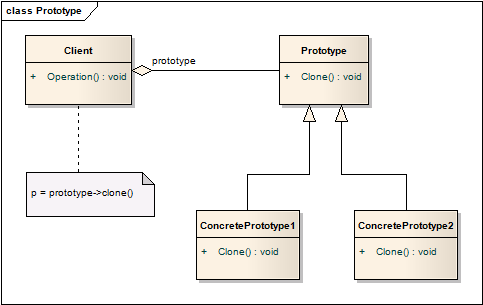

# 原型模式 Prototype
## 意图
使用原型实例指定创建对象的种类，然后通过拷贝这些原型来创建新的对象。

原型模式的核心在于原型提供的`clone`方法。

## 适用性
当系统和产品的创建、组合、表现分离时，可以使用原型模式，另外：

* 具体实例化哪个类是运行时才决定，或者
* 避免构建与产品层级平行的工厂层级，或者
* 类的实例只会有不同状态组合的其中之一。相比于每次实例化，从原型克隆（clone）会更加的方便。

## 结构

## 模式效果

原型模式有着抽象工厂模式和生成器模式相同的效果：向用户隐藏了具体的产品，减少用户需要了解的信息。另外，这些模式让用户只需要关心应用相关的内容，产品发生变化时无需做出改变。

原型模式特有的一些优势如下：

1. 运行时添加和删除产品

	原型模式使你能通过注册原型实例，将一个新的具体产品合并到系统中，这比其他的创建型模式更为灵活。
2. 通过改变值来指定新的对象

	高度动态的系统让你能够通过指定对象属性，定义新的行为，而非定义新的类。

	这一设计使得用户不用编码，就定义了新的“类”。事实上，原型克隆和类实例化很相似，原型模式能够大幅减少系统中所需的类的数量。

3. 通过改变结构来指定新的对象

	许多应用通过创建部件和子部件的方式创建对象，通过原型模式，我们可将各种部件作为原型，不同结构的部件作为不同的原型，简化对象的创建。

4. 减少子类

	工厂方法会创建与产品层级平级的工厂方法层级，而原型模式通过克隆创建对象实例，也就不存在创建方法层级。这一特性在C++这种不将类型作为一级成员（first-class objects）的语言中比较实用，在objective-c和python中效果不那么显著。

5. 配置应用动态加载类

	想要动态加载类，所依赖的构造方法就不能是静态的。通过原型注册和克隆方法，应用能够动态加载类。

所有原型的子类必须实现Clone方法，这对于已经存在的类是比较困难的（开发封闭原则，对类的扩展开放，修改封闭）。另外，对于不支持拷贝的对象Clone方法的实现也有难度。

## 实现

原型模式对于C++这样的静态语言很有帮助，这类语言中类型不是对象，运行时缺少类型信息。对于Smalltalk和Objective C这类语言的效果就不是那么明显。

实现原型模式时，需要考虑以下问题：

1. 使用原型管理

	当原型种类不固定时，需要维护可用原型的注册表，用户可能不会关心这个注册表中的具体内容，但是他们会尝试存入和取出原型。

	原型管理负责根据给定的Key返回所需的原型，需要提供给用户的操作包括注册、注销、获取，有时还有浏览。

2. 实现克隆操作

	原型模式最困难的就是实现Clone方法，尤其是存在环形引用时。很多语言都支持拷贝操作，但该如何解决“浅拷贝还是深拷贝”的问题？

	浅拷贝更加简单和高效，Smalltalk默认为前拷贝，C++的拷贝由成员类型决定，指针是共享一块内存的。而Clone方法大部分情况下需要深拷贝。实现时要根据具体的情况，决定哪些对象是可以共享，哪些是必须独立的。

	如果系统中的对象提供存储和加载操作，你能够使用Clone方法非常容易地实现：存储时就是Clone到内存，加载就是从内存中Clone得到对象。

3. 初始化克隆

	一些用户乐于直接调用Clone接口，而另一些希望能够向Clone提供一些状态或参数。向Clone操作中传递参数有碍Clone接口的一致性。

	如果原型类型提供了设置状态的方法，用户可以在Clone接口之后立刻调用，如果没有这样的方法，就需要引入初始化方法了。初始化方法传入参数，并设置Clone的内部状态。

