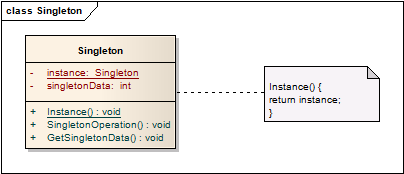

# 单例模式 Singleton

## 意图
确保类只有唯一的实例，并提供访问该实例全局入口点。

## 案例
单例模式太常见了，以至于想不到什么特别的经典案例。

开发中非常常用这一模式，比如配置管理（全局只有一份配置，各处有访问的需要）

单例模式提供全局唯一的入口点，除此之外无法创建对象。

## 适用性

* 对象必须有且只有一个实例，且有一个能够访问该对象的入口点；
* 当子类需要扩展这一单例，用户能够使用这一扩展的单例而无需修改他们的代码；

## 结构

`Instance()`方法是外部访问Singleton实例的唯一入口点。

## 模式效果

1. 管控对单个实例的访问。
2. 简化的命名空间

	使用单例模式是对使用全局变量的一种改进，能够使得命名空间保持整洁清晰。

3. 允许精炼操作和表现

	单例也是可以被继承的，能够使用某个单例来配置应用。这样你就可以在运行时选择单例完成应用的配置工作。

4. 控制实例的数量

	单例模式同样允许让Singleton类有多个实例对象，只需要修改那唯一的入口点即可。

5. 相比与类方法更为灵活

	相比于使用类方法，使用单例访问成员方法更为灵活。

	另外，C++中静态方法(static)永远不能是虚函数，子类也就不能多态复用。

## 实现
1. **确保**只有唯一的对象

	代码实现中往往只提供唯一访问对象的入口，而将对象创建方法隐藏。该入口确保返回的唯一的对象在返回之前完成初始化。

	以下是C++中的最基本的实现方式：

		// Singleton.h
		class Singleton { 
		    public: 
		        static Singleton* Instance(); 
		    protected: 
		        Singleton(); 
		    private: 
		        static Singleton* _instance; 
		}; 
		 
		// Singleton.cpp
		Singleton* Singleton::_instance = 0; 
		 
		Singleton* Singleton::Instance () { 
		    if (_instance == 0) { 
		        _instance = new Singleton; 
		    } 
		    return _instance; 
		}

	对于C++，不将_instance定义为全局或静态对象，主要出于以下几个理由：
	
	* 无法确保只有一个静态对象被声明；这是一个责任的问题，本类型的单例，就该由本类型确保其唯一性，而不是将其托付给其他角色；
	* 单例对象的创建可能需要一些值，这些值必须是程序运行过程中才能取得的；
	* C++没有对全局对象的创建顺序有明确定义，这使得使用全局对象作为单例实体，就不允许对其他对象存在依赖，没有必要添加这一限制；
2. 单例类的继承

	* 通过唯一入口实例化时指定具体的子类类型。**C++中static方法是不能为虚的**，如果存在多个子类需要有某个特定的Tag方能实例化；
	* 将实例化方法从基类转移到子类中；
	* 使用**单例注册表(registry of singleton)**。提供注册和查找的静态方法，子类负责向基类注册单例，使用时在注册表中查找已注册的单例进行使用

			 class Singleton { 
			    public: 
			        static void Register(const char* name, Singleton*); 
			        static Singleton* Instance(); 
			    protected: 
			        static Singleton* Lookup(const char* name); 
			    private: 
			        static Singleton* _instance; 
			        static List<NameSingletonPair>* _registry; 
			}; 