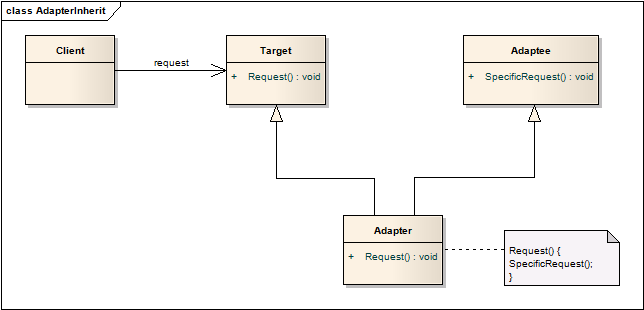
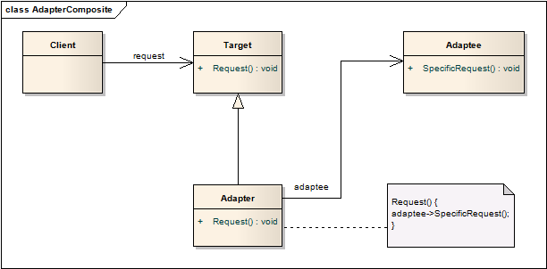
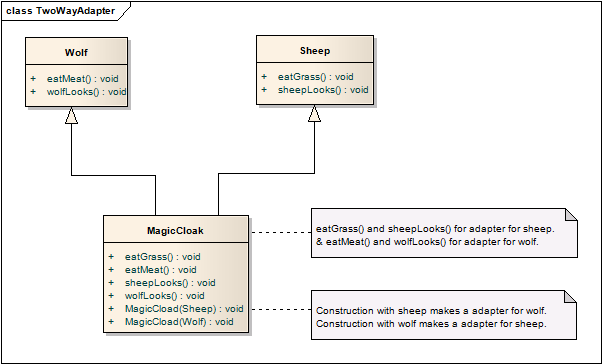
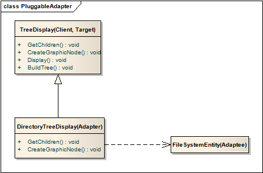
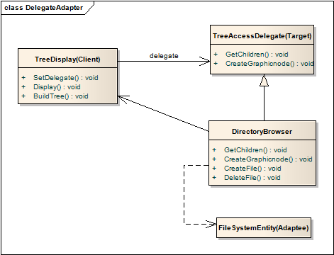

# 适配器模式 Adapter

## 意图
将一个类的接口转换成用户期望的接口形式。适配器使得原本因为接口不兼容而无法协同工作的类能够被正常调用。

适配器模式也被成为封装器、包装器（Wrapper）

## 经典场景
1. 欧版插座和亚版插座的适配；
2. Objective-C中的Delegate的使用；

## 适用性

适配器模式非常容易理解，它的适用场合也很容易想到：

1. 想要适用一个已经存在的类，但接口却不是我们想要的；
2. 创建了一个希望那个被复用的类，该类需要和未知的、目前不相关的类兼容；
3. 需要适用已经存在的多个子类，但去一一适配这些子类的接口不现实，此时就需要一个`对象适配器`来适配基类的接口

## 结构
适配器有两种实现方式：继承或组合：

1. 继承
	
	适配器继承操作对象和适配目标。这类适配器成为**类适配器**（**Class Adapter**）。

	

2. 组合

	适配器继承操作对象，并持有适配目标的引用。这类适配器成为**对象适配器**（**object adapter**）.

	

## 模式效果
类适配器和对象适配器各有优劣。

类适配器：

* 由于类适配器继承了适配者，这使得该适配器对其子类不起作用；
* 由于是继承关系，适配器能够重载适配者的方法；
* 只增加了一个对象，而无需额外的指针或引用；

对象适配器：

* 不但是适配者，连其子类也能被适配器调用；
* 难以重载适配者的行为，有时候需要添加一个额外的子类给适配器调用，从而达成预期；

使用适配器时，需要考虑以下一些因素：

1. 适配器需要做多少适配工作？这主要取决于目标接口和适配者接口之间的相似程度。
2. 插件适配器：类中内置的接口适配器，称为插件适配器，使用时能够使用几个适配器中的一个。
3. 使用双向适配器来提供透明度。被适配的对象不再兼容Adaptee的接口，因此并不是所有Adaptee可以被使用的地方适配器都可以被使用。双向适配器提供了这样的透明性。在两个不同的客户需要用不同的方式查看同一个对象时，双向适配器尤其有用。

## 双向适配器
网上看来的一个例子，解释了双向适配器的概念。

假设有一群狼和一群羊，其中有一只狼W和一张羊S由于某些狗血的原因成为了好朋友，狼想请羊去家里玩，羊也想请狼去家里玩，但两个族群是天敌，不可能友好相处。

他们想了一个办法，做一张神奇的披风，一侧是羊皮，一侧是狼皮，羊S披上就可以伪装成狼，狼W披上另一面就可以伪装成羊。有了这张披风，两个小伙伴又能快乐地玩耍了。

在这里，这张神奇的披风就是一个双向适配器，经过它的适配，羊可以适配成狼，狼可以适配成羊。

## 实现
1. 适配器的C++实现：适配器公有继承Target，私有继承适配对象，这样适配器就是Target的一个子类，而不会是被适配对象的子类。
2. 插件适配器的实现：
	* 使用抽象方法的插件适配器

		

		TreeDisplay的使用方法：

			GetChildren(n);
			for each chile {
				AddGraphicNode(CreateGraphicNode(child));
				BuildTree(child);
			}
		DirectoryTreeDisplay适配了文件系统的方法，使之能够显示目录结构。

	* 使用代理的插件适配器 

		

		TreeDisplay的使用方法：

			delegate->GetChildren(this, n);
			for each chile {
				AddGraphicNode(delegate->CreateGraphicNode(this, child));
				BuildTree(child);
			}
		委托这一形式在Objective-C中使用的非常频繁，也非常实用。TreeDisplay中包含一个delegate对象，该对象可以根据不同的需求进行切换。