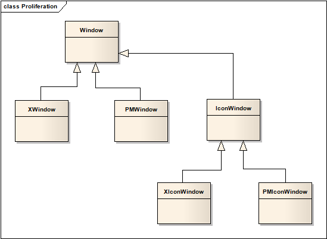
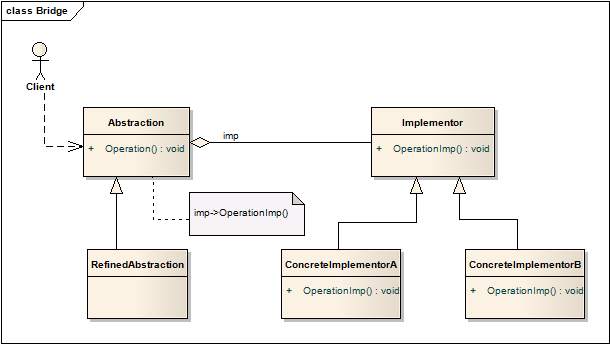

# 桥连模式 Bridge
解耦抽象和实现，使两者能够互不干扰地变化。

举例来说，画图，我可以画矩形，圆，三角形等等，在哪里画呢？我可以在pdf上画，也可以在doc上面画。画什么图和在哪里画都是可以独立变化的，此种情况就比较适合用桥模式。就是说设计中有超过一维的变化我们就可以用桥模式。如果只有一维在变化，那么我们用继承就可以圆满的解决问题。

## 适用性
* 避免抽象与实现之间固定的绑定（例如子类实现接口方式），这样做能够实现动态切换实现。
* 抽象和实现都会被继承。桥连模式使你能够组合不同的抽象和实现。
* 修改抽象的实现时，不需要用户重新编译才能起作用。
* C++中希望对客户完全隐藏抽象的实现，可以考虑使用桥连模式，因为在C++中类的表现在类接口中是可见的。
* 系统中的类可能存在如下结构图所示的增殖情况，希望能摆脱这种糟糕的设计

	

	>最顶层的抽象为Window，在不同的桌面平台有不同的子类XWindow和PMWindow。除了从平台角度划分，还可以从功能角度划分，存在基类IconWindow，而IconWindow也存在不同平台的实现XIconWindow和PMIconWindow。没种功能的Window都会存在多平台的实现，如果支持的平台增加了，没种功能Window也需要扩展对应实现。这就是所谓的类的增殖。

* 希望能在多个对象间共享实现，而且这个希望是对客户隐藏的。

## 结构

## 模式效果

1. 解锁接口和实现
2. 提高可扩展性

	能够对抽象层级和实现层级分别扩展，不变的部分能够正常运行。
3. 向客户隐藏实现细节

## 实现

1. 唯一的实现

	有些场合只有一种实现，就没必要创建一个抽象的实现基类了。这是一种桥连模式的退化情况，但依然尤其价值。

2. 创建正确的实现对象

	如何决定该使用哪种实现？

	如果抽象知道所有的具体实现类，就能在实例化时构造相应的实现。这所有的实现可以被存放在列表、或者映射中。

	另一种方式是初始化时选择一种默认的实现，然后根据具体使用变更实现。

	还有一种方案是将实现的选择委托给另一个对象，例如可以是一个抽象工厂，工厂负责返回对应的一整套实现，好处是抽象并不直接和任何实现类耦合。

3. 共享实现
4. 使用多重继承

	部分语言支持多重继承（比如C++），一个子类能够public继承抽象，private继承具体实现，从而达成预期效果。

	但这一做法使得抽象和实现永久绑定，本质上已经不再是桥连模式了。

