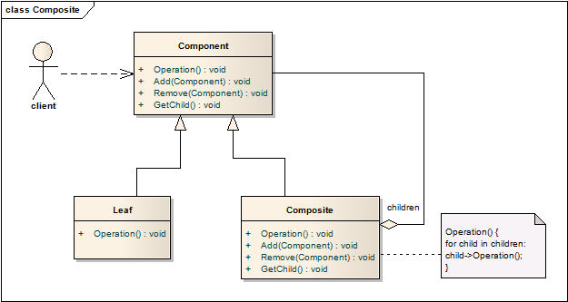
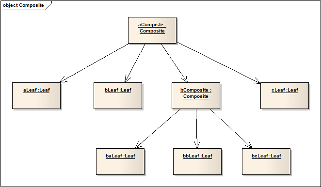

# 组合模式 Composite
## 意图
将对象以树形结构组合成一个整体，表现出部分-整体这一层级结构。组合模式使得用户能够像使用对象一样使用这个组合。

## 经典场景
组合模式在日常绘图软件的使用中经常会用到。例如先绘制了几个图形，然后将这些图形选中，将它们“组合”起来，之后就能像使用单个图形那样，拖拽、缩放、连线这些操作都能使用。

## 适用性
1. 希望表达对象之间“部分-整体”的层级结构；
2. 希望用户能够忽略单个对象和对象组合之间的差异，一视同仁地进行操作；

## 结构

一个典型的组合模式结构一般如下：

用户使用抽象基类Component的接口，如果实际对象是Leaf，则直接操作，如果对象是Composite，则依次执行其中的Component操作。

## 使用效果
1. 定义了由简单对象和组合对象组成了层级结构，简单对象能够组成更为复杂的对象，复杂对象也能用于继续组合。能够处理简单对象的用户代码，也能处理复杂对象；
2. 让客户代码更简洁。客户代码能够统一处理组合对象和单个对象，无需对其分类处理；
3. 能够很容易地添加新的组件，客户代码可保持不变；
4. 缺点是会限制你的设计，因为要让每个组件都极度统一。有时候你希望某些组合中只包括组件集的一个子集，此时就需要一些运行时检验了。

## 实现
1. 在Component基类中添加显示的父节点的引用

	有利于层级关系的处理。父节点引用的设置和消除尽量写在`Add`和`Remove`方法中，而不要开放给用户使用；

2. 共享组件。
 
	两个组合中有同一个对象，这两个组合可以共享这一对象，这有时候非常有用，比如减少存储空间需求，但在子节点中记录多个父节点会比较困难。这一话题在**蝇量模式**再深入讨论。
3. 最大化组件接口。

	为了能让客户代码方便地调用接口，当然希望组件基类有尽可能完备的接口提供。但这样又会让Leaf对象中出现大量的方法根本没有实现。
4. 子类管理方法的声明

	Composite实现了Add和Remove方法，但这两个方法该在那里声明呢？是Component基类，还是Composite基类？

	这是一个安全性和透明度的权衡：
	
	* 在所有类结构的基类Component中定义管理接口提供了透明度，使用户能够对所有对象一视同仁；但这么做缺乏安全性，因为用户可能会在Leaf中调用Add、Remove方法；
	* 在Composite基类中定义管理接口能够提供安全性，但这样的话Leaf和Composite就有了不同的接口，缺少透明度，用户就必须知道当前对象的基本类型；

	从OO开发来看，透明度应该更为重要一些，为了弥补安全性问题，可以有以下方法可以参考：

		class Composite
		
		class Component {
		public:
			// ...
			virtual Composite *GetComposite() { return 0; }
		}
		
		class Composite : public Component {
		public:
			void Add(Component *);
			// ...
			virtual Composite *GetComposite() { return this; }
		}
		
		class Leaf : public Component {
		public:
			// ...
		}
		
		// ... 
		if (test = aComponent->GetComposite()) {
			test->Add(new Leaf);
		}

5. 该不该在Component中添加子类列表？

	同样是处于透明度考虑，那是否该这么做？这样做最大的缺点是浪费空间，只有在仅有较少Leaf的系统中这么做。

6. 子对象的排序

	可能会有Composite中的Component排序的需求，例如绘图程序中，每个Component就是以图层的前后作为排序依据。如果确实有这样的需求，就要在实现时考虑这个问题。

7. 通过缓存提高性能

	如果Composite经常会被查询或遍历，就有为其缓存的必要。当修改了其中一个Leaf时，这一缓存就需要被更新，所以显示指向父节点的引用此时就显得各位重要。

8. 生命周期管理

	子对象的生命周期由其父对象管理，即由Composite负责删除其中的Leaf或子Composite。
	
	但是，当Leaf对象是不可变且共享的，就不符合这一原则。

9. 该使用何种数据结构来存储对象？

	链表、树、数组、哈希表这些都可以，效率优先。事实上有时甚至不需要使用数据结构，Composite中的Component是一个“萝卜一个坑”预先定义好了的。