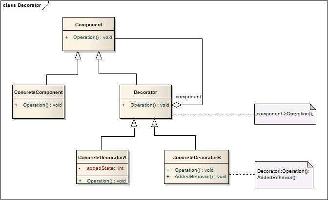

# 装饰器模式 Decorator
## 意图
动态地向对象添加额外的功能。装饰器提供了扩展对象功能的选择。

静态添加功能，第一时间想到的就是继承，但动态地、只针对对象个体地添加功能的需求，就是装饰器所擅长的。

## 经典场景
装饰器有一个非常经典的咖啡的范例，有机会将这一场景引入，能够更好地说明。

## 适用性
* 动态地、透明地向单个对象添加功能（或者说职责），而不会影响同类型的对象；
* 添加的职责能够被收回；
* 想要添加功能，但是使用子类继承的方法是不切实际的，例如添加大量独立的扩展会影响大量代码，或者某个类不可见，无法进行继承；
	* 例如结构中描述的，ConcreteComponent类文件不可见，只能访问到其基类Component的场景。 

## 结构

## 模式效果
装饰器模式至少有两个优点、两点不足：

1. 相比与静态的继承更为灵活

	装饰器能够在运行时为对象添加职责。
	另一方面，装饰器允许为对象多次添加职责。以奶茶为例，可提供的奶茶类型有原味奶茶（奶茶基类）、半糖、全糖、多糖这么四种甜度的，价格也不一。如果使用继承，就需要有三个子类，但是如果使用装饰器，每被封装一次就是加半糖，不同类型的奶茶只是装饰次数的差异。

2. 避免在架构层级中创建囊括过多特性的类

	装饰器实现了需要时附加功能的特性，而不是在设计时就要充满远见地设计完备而复杂的类，对象不用在囊括许多本身根本用不到的特性。

	如果需要扩展特性，实现也非常方便。

3. 装饰器和对象本身并不一致

	装饰器和对象的外特性一致，但本质上并非同一事物，当需要用到对象的ID时会发生错误。
	具体到python的装饰器中，这个问题可以被语法糖`@wraps(fn)`解决。

4. 大量的小对象

	使用装饰器注定了会产生大量相似的小对象，虽然系统知道谁是谁，但是代码Review、调试时会比较困难。

## 实现
1. 接口一致性

	装饰器的接口和对象的接口必须一致！因此两者都是继承自同一基类。

2. 省略装饰器的抽象类

	如果只需要添加一个职责，那就不要定义什么抽象类了，直接使用装饰器基类进行装饰得了。

3. 保持Component基类轻量化

	Component基类中只定义接口，不定义具体成员，这样创建的装饰器也是轻量化的，否则大量的复杂的装饰器使用起来就不那么简洁轻量了。

4. “治标” vs “治本”

	装饰器是在原有行为上添加一层，可以认为是一种“治标”，另一种选择是改变对象的内部机制，称为“治本”，例如使用策略模式。此处的“治标”与“治本”并无绝对的优劣之分，不同场景下有不同的擅场。

	当Component是一个重量级对象，策略模式是一个更好的选择。Component将其某个行为交给独立的策略对象，策略模式能够在不同的策略对象间切换行为。关于策略模式，在相关章节中再做展开。

	由于装饰器模式在外部修改Component行为，Component本身对装饰器一无所知，所以装饰器对于行为是透明的。

	而对于策略模式，Component知道可能的扩展，会持有相应策略的引用。

	