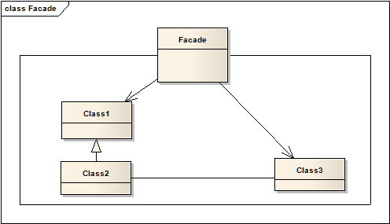

# 外观模式 Facade

## 意图
为子系统的一系列接口，提供一个统一的接口。外观模式为子系统提供了更高层级的接口调用，使系统更方便使用。

举一个例子，用户想要入手一台新电脑，他当然可以自己去挑选主板、内存、硬盘等，然后将这些组装起来（底层接口调用）；也可以找一个懂行的人，帮自己去完成这些技术含量更高的工作（上层接口调用，此时这个被委托人就是一个Facade）。

## 适用范围
* 希望对一个复杂的子系统提供简单的接口，用户主需要面向这一外观即可访问子系统；
* 用户调用一个抽象的实现时会涉及到许多的依赖，通过外观实现解耦；
* 希望将子系统层级化，使用外观模式来定义每个层级的入口。如果各个子系统是独立的，可以使用外观作为他们之间的交互接口

## 结构

外观模式的结构非常灵活，只要是通过Facade访问子系统就可以，其内部具体是如何调用没有限制。

## 模式效果

1. 将用户和子系统隔离，减少了用户需要处理的对象，简化了子系统的使用；
2. 使用户和子系统之间松耦合。松耦合使得子系统内部成员变化时不会影响用户。
3. 在必要的情况下，外观模式并不阻止直接使用子系统的类，由用户决定是要易用性，还是通用性。

## 实现
实现外观模式时，需要考虑以下一些因素

1. 减少用户-系统之间的耦合。

	除了外观模式本身的松耦合特性，更进一步的做法是创建Facade抽象类，对于不同的子系统实现具体的Facade子类。用户通过Facade基类的接口与子系统交互。这一做法使得用户无需了解当前使用的是哪个子类的实现。

	另一种方法是为Facade配置不同的子类对象（类似策略模式），通过替换子系统对象来定制Facade。

2. 公有还是私有的子系统类？
	
	子系统可以和类进行类比，他们同样包含接口，同样封装内容——类封装状态和方法，子系统封装类。就像设置类的访问控制一样，我们可以考虑子系统接口究竟是公开的，还是私有的。

	公有的接口是所有用户都能访问的，私有接口是仅对内部类开放的。Facade肯定是一个公有的接口，但不是唯一的一个，子系统中的其他接口也可以是公有的，有通用性需求的用户可以访问。