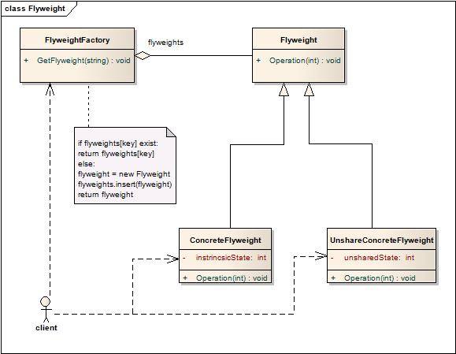
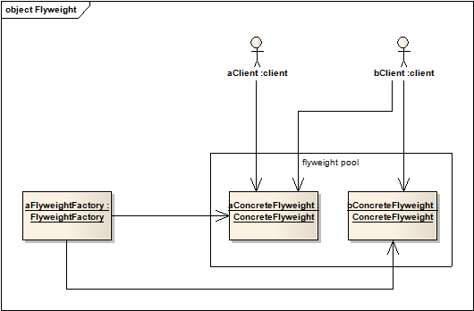

# 蝇量模式 Flyweight

## 意图
使用共享方式高效地支持大量的粒度细的对象。

又称为享元模式。

## 进一步说明
蝇量模式的核心可以认为就是存在一个蝇量对象池，对象池中的对象记下对象的内在属性，当需要获取对象时首先尝试从池中取出对象，取不到时才考虑创建。

例如，内存池。

## 适用性
蝇量模式的效果非常依赖于使用场景，确保只有在以下条件**都满足**时，使用蝇量模式：

* 应用中会有大量的对象；
* 存储这些大量的对象会非常耗费资源；
* 对象的大部分状态是外在的；
* 一旦将这些外在状态移除，许多对象能够用相对较少的共享对象替代；
* 应用不依赖于对象标识。因为蝇量对象是共享的，只要逻辑上不同的对象，即使共享了同一个对象，也能被认为带有不同标识。

## 结构

下图展示了通常蝇量模式是如何使用的

### 核心角色责任
* Flyweight
	* 申明一个接口，接收外部状态并执行相应操作
* ConcreteFlyweight
	* 存储内部状态，实现接口；
	* 必须是可共享的，只能有内部状态，必须是上下文无关的；	  
* UnsharedConcreteFlyweight
	* 并非所有的Flyweight都要是可共享的；
	* 通常UnsharedConcreteFlyweight包含ConcreteFlyweight
* FlyweightFactory
	* 创建、管理flyweight对象
	* 如果flyweight已存在，返回共享对象；否则，创建flyweight对象并返回
* Client
	* 持有flyweight的引用
	* 计算或存储flyweight对象的外部状态  	 

## 模式效果
蝇量模式可能会增加运行时处理外部状态的资源消耗，但是能够通过对象共享节省存储。存储容量与以下几个因素有关：

* 通过贡献减少的对象数量；
* 每个对象的内部状态的数量；
	* 空间和时间的取舍 
* 外部状态是否需要计算或存储；
	* 通过计算而不是存储得到外部状态更能节省空间

蝇量模式经常和组合模式共同使用。

## 实现
1. 删除外部状态
	* 模式是否适用很大程度上由能否很方便地识别出外部状态、并将其从对象中删除有关；
	* 理想状态是外部状态能够非常容易地计算得到； 
2. 管理共享对象
	* client不允许直接实例化共享对象，而应委托给FlyweightFactory；
	* FlyweightFactory返回共享对象，或实例化对象；
	* 可以使用引用计数维护共享对象，但在flyweight数量固定且较少时，没有这么做的必要 

