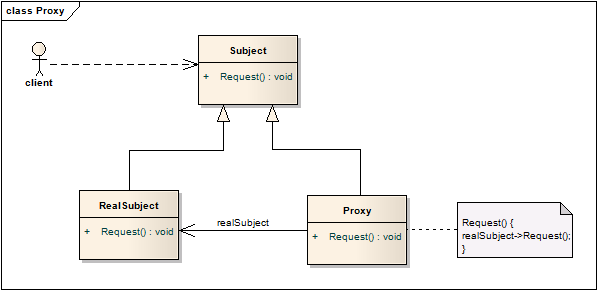

# 代理模式 Proxy

## 意图
为对象提供代理或占位符，实现访问控制。除了Proxy，也被称为Surrogate。

需要访问控制的其中一个理由是，延迟对象的创建和初始化，直到我们真的需要使用它。例如有一个包含了很多图片的文档，如果在打开时就将所有的图片都加载到内存中，那文档打开就会非常迟缓，这时候就可以用一个图片代理对象来替换真实的图片。图片代理有着图片的一些基本信息，例如长和宽，也有着如何找到这张图片的引用，例如URL。只有到需要显示这些图片时，才会去尝试通过引用加载图片。

## 使用范围

当需要一个相比于指针更为通用、复杂的引用，来指代对象时，通常会考虑使用代理模式，以下是一些使用的场景：

1. 远程代理(**remote proxy**)提供了不同地址空间中对象的本地代表。
2. 虚拟代理(**virtual proxy**)为初始化开销大的对象设置代理，延迟创建对象。
3. 保护代理(**protection proxy**)管控原始对象的访问权限。当对象对于不同用户提供不同访问权限时，这类代理很有用。
4. 智能引用(**smart reference**)是裸指针的一个替代，当对象被访问时会有一些额外行为，典型的使用包括：
	* 引用计数
	* 首次引用时负责将加载对象
	* 当对象被访问时检查是否被锁

## 结构

## 模式效果

1. 远程代理屏蔽了对象其实是不同地址空间的事实；
2. 虚拟代理优化了对象加载；
3. 保护代理和智能引用都在对象访问时添加了额外的管理功能；

另一种使用代理模式优化的做法，称为**copy-on-write**。拷贝一个复杂的大对象开销很大，如果这一拷贝从未被修改，那就没有必要去真正地拷贝。通过使用代理模式延迟拷贝的过程，确保只有在被修改后才执行拷贝操作。

上述操作要求对象进行引用计数，拷贝时引用计数+1，修改时引用计数-1并进行拷贝和修改，引用计数减为0时删除对象。

## 实现

1. 使用C++实现时，重载成员访问操作符(->)

	每当对象被接触引用，重载该操作符使你能执行额外的工作，通过重载操作符，代理就能像指针一样地使用。